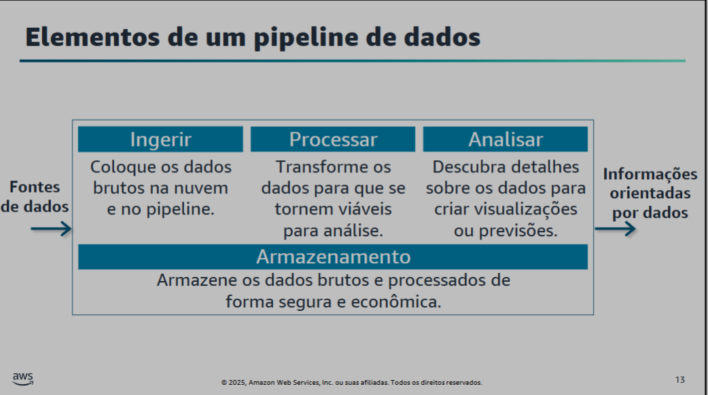

# Arquitetura

Redshift Spectrum: analisa dados direto do S3

Reshift normal: analisa dados dentro do seu cluster, geralemnte tem que dar um COPY

mesma aplicacao porem com caminhso diferentes

post click ⇒ kinesis ⇒ lambda, glue ou emr ⇒ redshift

usuario ⇒ web ⇒ app ⇒ banco de dados