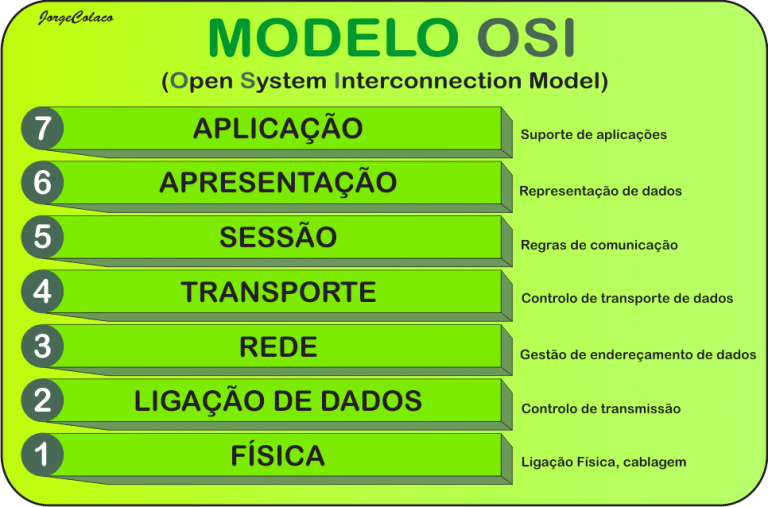

# ELB

## Diferenca de ELB NLB:

ALB nivel de aplicacao http https MAIS LENTO Por path, host, header (sites APIs Microsservicos)

NLB nivel de transporte TCP UPD MAIS RAPIDO apenas por IP e Porta (Private Link, Jogos, IOT)

Health Check:

EC2 (uma só)
    └── app.js / [main.py](http://main.py/)
    ├── /api/checkout    ← lógica de negócio
    ├── /api/login       ← lógica de negócio
    └── /api/health      ← só retorna 200 OK