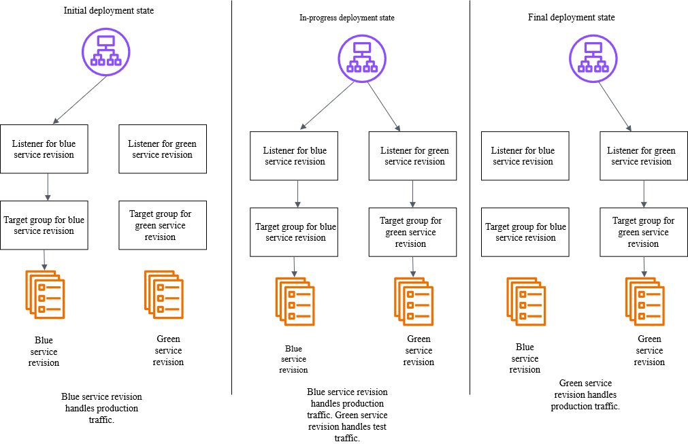

# JAM ECS azul a verde: implantação sem tempo de inativi...

primeiro JAM medio que estou fazendo e ira cair medios no Worldskills, foi complicado apenas na primeira task fiquei 2h, nao sabia o que era ECS, nao sabia sobre servicos, sobre cluster, agora sei amis ou menos mas ainda nao seia hierarquia, reciso aprender, nao sei subir container, aprendi as coisas que fiz nesse LAB, entao o resto nao sei acho que e bom entender algumas coisas e podem cair no worldskills sobre, nao usei IA, so no final pois ja nao sabia como fazer ai tive que usar o metodo azul/verde que achei que so era a tela mas e uma maneira de verdade da aws, tinha documentacao e eu nao li, vi o diagrama que estava na documentacao e acheiq ue era pra fazer aqui, criar outro servico, depois deixar o elb 50 50 e desatiovar um servico e colocar 100 do verde, na minha cabeca era isso e era isso que a iamgem mostrava vou mandar o desafio:

visao geral: (uma duvida interessante sera que e bom ler o visao geral?)

```json
🏢 Bem-vindo à AnyCorp!
Sua primeira missão como engenheiro de DevOps 🚀
Onde a inovação encontra a confiabilidade

🌟 O desafio
Bem-vindo à AnyCorp, uma potência de comércio eletrônico em rápido crescimento! Como novo DevOps Engineer, sua primeira missão é executar uma implantação azul/verde perfeita usando Amazon ECS

📱 A situação
A equipe de desenvolvimento criou uma nova versão do aplicativo com tema verde para substituir a interface azul existente. Seu objetivo? Implante a nova versão sem tempo de inatividade, garanta a reversão instantânea, se necessário, e mantenha uma experiência perfeita para o cliente durante a transição.

🎯 Sua missão
O sucesso nessa missão demonstrará sua capacidade de equilibrar agilidade com estabilidade — uma marca registrada de todo grande profissional de DevOps. Você está pronto para liderar a mudança? 🚀

Você está pronto para mostrar sua experiência em DevOps? Vamos começar! 🚀

Leia menos
```

task 1:

```json
ECS azul a verde: implantação sem tempo de inatividade
Selecione um desafio abaixo para começar.

Resolva usando:

Abra o console da AWS
>_AWS_CLI
Reiniciar o desafio
Propriedades de saída
ClusterArn
arn:aws:ecs:eu-west-2:778955484556:cluster/TechCorp

ListenerArn
arn:aws:elasticloadbalancing:eu-west-2:778955484556:listener/app/bluegreen-alb/0b5842b94fe90e30/5c31d1ae8d5df442

LoadBalancerArn
arn:aws:elasticloadbalancing:eu-west-2:778955484556:loadbalancer/app/bluegreen-alb/0b5842b94fe90e30

ServiceArn
arn:aws:ecs:eu-west-2:778955484556:service/TechCorp/service-bluegreen

Seu desafio está pronto!
Tudo de bom, e lembre-se de se divertir!

Tarefa 1: Mudar para implantação azul/verde
Pontos possíveis
120
Penalidade por pista
0
Pontos disponíveis
0

Tarefas e pistas
📝 Plano de fundo
Sua primeira tarefa é modificar a configuração existente de implantação do serviço ECS de Rolling Update para implantação ECS Native Blue/Green. Atualmente, o serviço está sendo executado com:

🔵 Um aplicativo web com tema azul
🔄 Modo de implantação de atualizações contínuas
🏷️ Definição de tarefas versão 1 (versão azul)
⚖️ Balanceador de carga de aplicativos para roteamento de tráfego
📚 Compreendendo a implantação nativa azul/verde do ECS
Com a implantação azul/verde nativa do ECS:

🟢 Novas tarefas (verdes) são lançadas com a definição de tarefa atualizada
🔵 As tarefas originais (azul) continuam servindo tráfego
⚖️ O tráfego é alterado somente quando as novas tarefas são saudáveis
↩️ Fácil reversão transferindo o tráfego de volta para tarefas azuis
🗑️ Tarefas antigas são encerradas após a implantação bem-sucedida
📌 Observação: Para essa implantação, não configuraremos o tráfego de teste, focando apenas na mudança do tráfego de produção entre ambientes azul e verde.

🎯 Sua tarefa
Atualize a configuração de implantação do serviço ECS:

Use a versão 2 da Definição de Tarefas [A nova versão contém uma página da Web com tema verde]
Habilite a implantação azul/verde usando o controlador de implantação ECS nativo
Configure o tempo limite de encerramento para tarefas antigas
Defina a configuração de implantação para mudança de tráfego
🛠️ Começando
Navegue até o console do ECS
Localize seu serviço no cluster
Atualizar a configuração de implantação do serviço
Acione a implantação com a nova definição de tarefa
📦 Inventário
**Detalhes do cluster ECS: ** Nome do cluster: TechCorp

**Detalhes do serviço ECS: **

Nome do serviço: service-bluegreen
Definição de tarefa atual: tech-corp:1 (versão azul)
Nova definição de tarefa: tech-corp:2 (versão verde)
Tarefas em execução: 1
Controlador de implantação atual: ECS (atualização contínua)
**Detalhes do balanceador de carga: ** ALB: azul-verde-branco Ouvinte de produção: Port 80 Grupo alvo azul: techcorp-blue-tg Grupo-alvo verde: techcorp-green-tg

🔍 Validação
Para verificar a configuração atual:

Abra seu navegador
Navegue até o ALB DNS
Confirme que você vê a página da web com tema azul
Após a conclusão da implantação, você deverá ver a página da web com tema verde
💡 Serviços que você deve usar
Amazon ECS
Balanceador de carga de aplicativos
✅ Validação de tarefas
A tarefa será concluída quando:

A configuração de implantação do serviço é atualizada para ECS Blue/Green
A nova definição de tarefa (versão 2) foi implantada com sucesso
A cor da página da Web muda de azul para verde quando a implantação é concluída
📚 Recursos adicionais
Documentação de implantação azul/verde do ECS

🔔 Importante: Certifique-se de monitorar o progresso da implantação no console do ECS. Durante a implantação, o serviço lidará automaticamente com a mudança de tráfego do ambiente azul para o verde.

Precisa de ajuda? Use as dicas abaixo! 👇

Pistas
Atualizando a configuração do serviço ECS
12Pontos de penalidade
Desbloqueie o Clue
Guia passo a passo
15Pontos de penalidade
Desbloqueie o Clue
```

documentacao, achei estranho por que estava azul/verde sendo que o desafio era disso, mas era por que era ums servico, documentacao:

https://docs.aws.amazon.com/pt_br/AmazonECS/latest/developerguide/blue-green-deployment-how-it-works.html

desenho em questao que me confundi



um problema que tenho que abrir servicos que o JAM nao esta mandando, melhorar nisso tbm

nao li tudo 

task 2:

```json
ECS azul a verde: implantação sem tempo de inatividade
Selecione um desafio abaixo para começar.

Resolva usando:

Abra o console da AWS
>_AWS_CLI
Reiniciar o desafio
Propriedades de saída
ClusterArn
arn:aws:ecs:eu-west-2:778955484556:cluster/TechCorp

ListenerArn
arn:aws:elasticloadbalancing:eu-west-2:778955484556:listener/app/bluegreen-alb/0b5842b94fe90e30/5c31d1ae8d5df442

LoadBalancerArn
arn:aws:elasticloadbalancing:eu-west-2:778955484556:loadbalancer/app/bluegreen-alb/0b5842b94fe90e30

ServiceArn
arn:aws:ecs:eu-west-2:778955484556:service/TechCorp/service-bluegreen

Seu desafio está pronto!
Tudo de bom, e lembre-se de se divertir!

Tarefa 2: Ative a proteção de implantação com o disjuntor
Pontos possíveis
30
Penalidade por pista
0
Pontos disponíveis
30
Verifique meu progresso

Tarefas e pistas
📝 Plano de fundo
Ótimo trabalho na configuração da implantação _Blue/Green! _ Agora é hora de fortalecer seu processo de implantação com a proteção de implantação usando o disjuntor de implantação do ECS.

A equipe de desenvolvimento preparou a versão 3 do aplicativo web, mas não tem certeza sobre sua estabilidade. Sem um disjuntor, implantações malsucedidas podem deixar seu serviço em um estado instável. O disjuntor monitora automaticamente o processo de implantação, detecta falhas e reverte para a última versão estável quando necessário, ajudando você a atingir tempo de inatividade zero e implantações à prova de falhas.

🔄 Estado atual
✅ A implantação azul/verde está configurada
🟢 O serviço está sendo executado com a versão 2 (tema verde)
⚠️ A proteção de implantação está atualmente DESATIVADA
🚀 A versão 3 precisa ser implantada com proteção
📚 Compreendendo o disjuntor
O disjuntor de implantação do ECS:

🛡️ Monitora a integridade da implantação
🔍 Detecta falhas no lançamento de tarefas
⚡ Identifica estados de serviço instáveis
↩️ Permite a reversão automática
🔔 Nota: Sem proteção de implantação, implantações com falha podem deixar seu serviço em um estado instável.

🎯 Sua tarefa
Ative o disjuntor de implantação do ECS:
Serviço de atualização com a nova definição de tarefas versão 3
Ativar a detecção de falhas
Configurar a reversão automática
Mantenha as configurações de implantação azul/verde existentes
Implante a definição de tarefas versão 3:
Deixe o disjuntor monitorar a implantação
Verifique se a proteção está funcionando
🛠️ Começando
Navegue até o console do ECS
Localize seu serviço no cluster
Atualizar a configuração de implantação do serviço
Acione a implantação com a nova definição de tarefa
📦 Inventário
**Configuração atual do serviço ECS: **

Nome do serviço: web-service
Definição de tarefa atual: tech-corp:2 (versão verde estável)
Nova definição de tarefa: tech-corp:3 (a ser implantada)
Proteção de implantação: desativada
**Detalhes do balanceador de carga: **

DNS da ALB: techcorp-alb-12345678.us-east-1.elb.amazonaws.com

💡 Serviços que você deve usar
Amazon ECS
✅ Validação de tarefas
Sua tarefa será validada em duas fases:

**Fase 1 - Verificação da configuração: **

O disjuntor de implantação está ativado
A reversão automática está configurada
Começa a nova implantação da versão 3
**Fase 2 - Verificação da proteção: **

⏳ Aguarde o progresso da implantação
🔄 Monitore a estabilidade do serviço
⚠️ Se ocorrerem falhas, aguarde até que o limite seja atingido
✅ Verifique a reversão automática para a versão 2
🔍 Etapas de monitoramento
**Assista ao progresso da implantação: **
Estado inicial → Implantação iniciada → Período de espera → Estado final (Versão 2) (Implantação da versão 3) (Fase de monitoramento) (Reversão ou sucesso)

**Principais indicadores a serem monitorados: **
Eventos de serviço no console do ECS
Status de integridade da tarefa
Mudanças no estado de implantação
Acionadores de reversão
**Cenários de sucesso: **
Ou: a versão 3 é implantada com sucesso
Ou: reversão automática para a versão 2 após o limite de falha atingido
⚡ Importante: Não intervenha manualmente durante o período de espera. Deixe o disjuntor fazer seu trabalho!

⏱️ Cronograma esperado
Início da implantação → [2-3 minutos] → Verificação do limite → [5-10 minutos] → Reversão automática

🎯 Validação concluída quando:
O disjuntor foi acionado
A reversão automática foi concluída
O serviço retorna ao estado estável com a versão 2
Todos os eventos são registrados no console do ECS
📚 Recursos adicionais
Documentação do disjuntor de implantação do ECS

⚠️ Importante: Uma vez configurado, o disjuntor detectará e responderá automaticamente aos problemas de implantação. Nenhuma intervenção manual é necessária!

Precisa de ajuda? Use as dicas abaixo! 👇

Pistas
Ativar o disjuntor e atualizar a definição da tarefa
3Pontos de penalidade
Desbloqueie o Clue
Passo a passo detalhado
3Pontos de penalidade
Desbloqueie o Clue
```

conseguir fazer mais dboa:

entendi a diferenca


fazendo pela segunda vez:

task 1:

eu ate consegui fazer rapido consegui compreender mas por que ja fiz uma vez, mas tenho algumas duvidas, como saber  criar um role para isso? quais permissao uma role para fazer bluegreen precisa?

task 2:

consegui fazer rapido pois lembrava, mas esqueci que se eu nao corrigir aquilo de testar tantas vezes ate tirar, no worldskills deveria ser diferente, ja que o tempo vale muito, relembrar isso, acho que na verdade nem tem como configurar isso, de escolher quantas vezes integro, acabei de ver e nao tem como, mas interessante, quero me aprofundar um pouco mais entender o que e cluster e etc

terminei i JAM