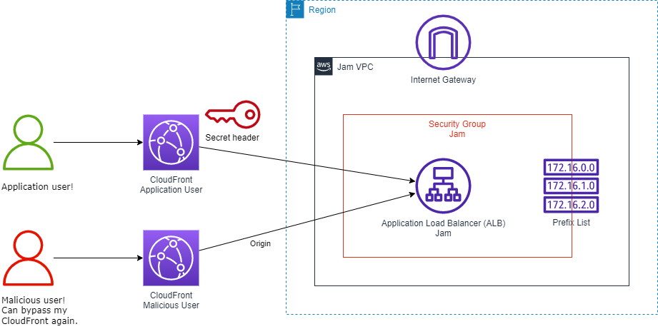
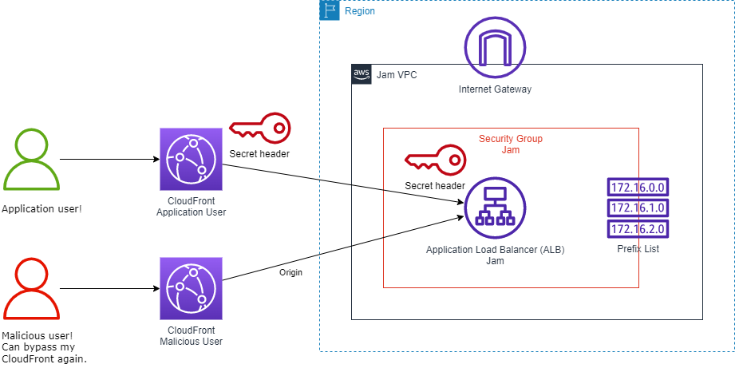
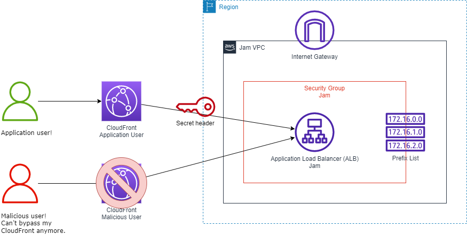

# JAM Proteja meu CloudFront Origin #9

contexto:

> 
> 
> 
> Você foi contratado como administrador de segurança certificado pela AWS para sua empresa. Você percebe que a conta da AWS da empresa tem o Amazon CloudFront na frente do Application Load Balancer (ALB) para proteger e acelerar a aplicação da empresa. Você vê que o ALB não tem proteção extra para evitar o desvio de conexão do CloudFront. Você está ciente das melhores práticas de segurança e deseja aplicar medidas extras para proteger o ALB como origem do CloudFront. Proteger seu ALB em L4 e L7 permitirá que somente sua distribuição específica do CloudFront se conecte com o ALB. Aumentando a segurança e reduzindo o custo. Neste desafio, você vai:
> 
> - Verifique se os usuários podem ignorar seu CloudFront.
> - Proteja-o no nível da rede (L4).
> - Verifique se os usuários ainda podem ignorá-lo usando a rede correta.
> - Proteja-o no nível do aplicativo (L7).
> - Verifique agora que ele só está disponível por meio de sua própria distribuição do CloudFront.

o que seria esse L4 L4 como ve essas tabelas?

task 1:

```wasm
Antecedentes
Antes de começarmos, vamos ver como os usuários podem acessar seu Origin, que é seu Application Load Balancer (ALB).

! <a href=” https://aws-jam-challenge-resources.s3.amazonaws.com/protect-cloudfront-origin/1.0.0/JamArchitecture-Task1.png “ALB Access"">Acesso ao ALB

Começando
Você foi solicitado a garantir que seu ALB esteja seguro para permitir a comunicação que vem somente do CloudFront.

Inventário
Dentro desse ambiente, existem:

Uma distribuição do CloudFront com a descrição Application User.
Um Application Load Balancer (ALB) chamado Jam
Você pode encontrar o URL da página da web do ALB e do usuário do aplicativo CloudFront disponível em Propriedades de saída.

O URL da página web do usuário do aplicativo é chamado CloudFrontAppUserWebPageURL.
O URL da página web do ALB é chamado ApplicationLoadBalancerWebPageURL.
Serviços que você deve usar
CloudFront ALB (pertence ao console EC2)

Sua tarefa
Abra a página da web do usuário do aplicativo CloudFront em seu navegador (abra-a em outra guia). O URL estará disponível como CloudFrontAppUserWebPageURL em Propriedades de saída. Você pode abri-lo usando HTTP ou HTTPS. O CloudFront redirecionará HTTP para HTTPS!
Abra a página da web do ALB em seu navegador (abra-a em outra guia). O URL estará disponível como ApplicationLoadBalancerWebPageURL em Propriedades de saída. Abra-o usando HTTP, não HTTPS!
Você notará que pode acessar as duas páginas da web. O que não é bom, porque os usuários podem ignorar seu CloudFront, evitando todas as medidas de segurança que você aplicou lá. Assim como as regras do WAF, restrições de localização geográfica e autenticação/autorização.

⚠ 👁 Atenção!
Certifique-se de abrir a página da web do Usuário do Aplicativo, chamada CloudFrontAppUserWebPageURL. Não aquele do Malicious User, chamado CloudFrontMaliciousUserWebPageURL.

Validação de tarefas
Você precisa abrir o URL do ALB e copiar o texto seguido de**Resposta da tarefa 1: ** e colá-lo no campo Enviar resposta.
```


task2:

```wasm
Seu grupo de segurança ALB tem uma regra de entrada que permite todo o tráfego HTTP da Internet (0.0.0.0/0). No nosso caso, queremos apenas que o tráfego venha do CloudFront. Você pode usar uma lista de prefixos gerenciada pela AWS para atender a esse requisito.

! <a href=” https://aws-jam-challenge-resources.s3.amazonaws.com/protect-cloudfront-origin/1.0.0/JamArchitecture-Task2.png “ALB Access"">Acesso ao ALB

Começando
Um grupo de segurança atua como um firewall que controla o tráfego permitido de e para seu balanceador de carga. Você pode escolher as portas e protocolos para permitir o tráfego de entrada e saída.

As regras dos grupos de segurança associados ao seu balanceador de carga devem permitir tráfego de entrada para a porta do ouvinte. No caso desse desafio Jam, o ouvinte está apenas na porta 80, protocolo HTTP.

Os grupos de segurança são estatais. Isso significa que o tráfego de retorno é sempre permitido para as regras de entrada que você cria, independentemente das regras de saída.

Há cotas sobre o número de grupos de segurança que você pode criar por VPC, o número de regras que você pode adicionar a cada grupo de segurança e o número de grupos de segurança que você pode associar a uma interface de rede. Para obter mais informações, consulte Cotas do Amazon VPC.

Para tornar sua conexão entre o CloudFront e o ALB mais segura, você pode ter uma regra para permitir apenas o tráfego da lista de prefixos do CloudFront Origin. Isso bloqueará seu Grupo de Segurança ALB no nível da rede (L4), o que significa que somente IPs do CloudFront serão permitidos.

Inventário
Grupo de segurança chamado Jam.

Serviços que você deve usar
VPC

Sua tarefa
Remova a regra atual que permite o tráfego da Internet, aquela com CIDR 0.0.0.0/0, do Grupo de Segurança chamado Jam
Adicione uma nova regra ao grupo de segurança chamada Jam que permite somente o tráfego HTTP da lista de prefixos do CloudFront Origin.
❌ 👮 Atenção!
Por favor, ignore qualquer outro grupo de segurança, somente aquele chamado Jam é relevante para esse desafio do Jam!

Você não pode atualizar a regra atual usando o CIDR para usar a lista de prefixos. Você DEVE remover a regra usando CIDR e adicionar uma nova regra usando a lista de prefixos.

Nem sempre é possível ler o nome completo da lista de prefixos quando você está alterando as regras do Grupo de Segurança. Então, é mais fácil usar o Prefix List ID. Também não é possível adicionar uma regra usando o nome da lista de prefixos. Use Prefix List ID.

Validação de tarefas
A tarefa será concluída automaticamente quando você corrigir o grupo de segurança. Como alternativa, você sempre pode verificar seu progresso pressionando o botão Check my progress na tela de detalhes do desafio.
```

[https://docs.aws.amazon.com/vpc/latest/userguide/working-with-aws-managed-prefix-lists.html](https://docs.aws.amazon.com/vpc/latest/userguide/working-with-aws-managed-prefix-lists.html)


esse laboratrio apenas explica que usar apenas o L4 baseado em IP (sg) nao e seguro, pois outro cloudfront que nao e o meu tambem conseguiria acessar meu ELB pois e o IP de todo cloudfront pois o cloud front é um servico global, mas para contornar isso temos a camada 7 L7!


[https://docs.aws.amazon.com/AmazonCloudFront/latest/DeveloperGuide/restrict-access-to-load-balancer.html](https://docs.aws.amazon.com/AmazonCloudFront/latest/DeveloperGuide/restrict-access-to-load-balancer.html)

como deixar mais seguro

A CAMADA 7 basicamente e um conceito como se fosse uma chave que seu elb so escuta o cloudfront que tem essa chave



esetudar mais Cloudfront

task3:

```wasm
Background
Now you locked your ALB to just allow communication from CloudFront. But which CloudFront? Are you sure it doesn't allow communication from someone else CloudFront?

Multi CloudFront

Getting Started
Using prefix list rule on security group control the access on network level (L4), which means that only CloudFront will be able to access your ALB. But CloudFront is a managed service, which mean any AWS account with a CloudFront distribution will share the same network address space.

Within this environment there are:

One CloudFront distribution with description Application User.
One CloudFront distribution with description Malicious User.
One Application Load Balancer (ALB) called Jam
You can find the web page URL for ALB, Application User CloudFront and Malicious User CloudFront available under Output Properties.

Application User web page URL is called CloudFrontAppUserWebPageURL.
Malicious User web page URL is called CloudFrontMaliciousUserWebPageURL.
ALB web page URL is called ApplicationLoadBalancerWebPageURL.
Perform the tests below:

Open ALB web page on your browser (open it on another tab). The URL will be available as ApplicationLoadBalancerWebPageURL under Output Properties. Open it using HTTP, not HTTPS!

You will notice it will timeout and will not open, as your IP address it not the one allowed by ALB Security Group.

Open CloudFront Application User web page on your browser (open it on another tab). The URL will be available as CloudFrontAppUserWebPageURL under Output Properties. You can open it using HTTP or HTTPS. CloudFront will redirect HTTP to HTTPS!

It will open on your browser, working as expected.

Open CloudFront Malicious User web page on your browser (open it on another tab). The URL will be available as CloudFrontMaliciousUserWebPageURL under Output Properties. You can open it using HTTP or HTTPS. CloudFront will redirect HTTP to HTTPS!

You will notice it also opens on your browser. This is not expected, as this is not our intended CloudFront.
Notice the address is different between them, so they are 2 different CloudFront distributions!

Secure your CloudFront communication

You can make it more secure if you apply a technique called secret header. This way it will lock your communication at application layer (L7).

Secret Header

Secret header works configuring a secret on both side of the communication, CloudFront and ALB. In this task you will configure just the CloudFront side.

Inventory
Refer the inventory from the previous task.

Services you should use
CloudFront

Your Task
Configure a custom header on CloudFront distribution with description Application User.
Header name: x-from-cf
Header value: MySuperSecret
It is case sensitive! It can take a long time to reflect your update configuration. Please be patient!

❌ 👮 Attention!
As secret header technique uses a secret shared by both sides of the communication, it is imperative to use a TLS communication (HTTPS)!
In this challenge it uses HTTP communication between CloudFront and ALB because it is not possible to have a SSL Certificate on Jam challenges.

Task Validation
The task will be automatically complete once you fixed the CloudFront origin. Alternatively, you can always check your progress by press the Check my progress button in the challenge details screen.

Clues
CloudFront Origin
Penalty 2 points
Unlock Clue
Walkthrough
Penalty 2 points
Unlock Clue
```

task 4:

```wasm
Background
You are almost there, you already have everything set on CloudFront side. You must tie the ends configuring the same secret on ALB side as well!

ALB Secret

Getting Started
Application Load Balancer (ALB) can have multiple listener rule.

Each listener has a default rule, and you can optionally define additional rules. Each rule consists of a priority, one or more actions, and one or more conditions. You can add or edit rules at any time. For more information, see Edit a rule.

Inventory
In this challenge you have only one listener on Jam ALB. The one called HTTP:80. This listener has two rules already configured.
You must configure your listener rule in order to allow the communication if it comes with correct secret header (name and value). Return Access denied if no other rule match the request attributes.

Services you should use
ALB (belongs to EC2 console)

Your Task
Change the rule configuration for priority default as:

Response code: 403
Content-Type: text/plain
Response body: Access denied
Change the rule configuration for priority 1 as:

Header name: x-from-cf
Header value: MySuperSecret
❌ 👮 Attention!
Rules already exist. You just need to change them according to this task requirement. So the current values will be changed to the ones defined above.

Task Validation
The task will be automatically complete once you fixed the ALB listener HTTP:80 rules. Alternatively, you can always check your progress by press the Check my progress button in the challenge details screen.

Clues
Listener rules
Penalty 2 points
Unlock Clue
Walkthrough
Penalty 2 points
Unlock Clue
```



[https://docs.aws.amazon.com/elasticloadbalancing/latest/application/introduction.html](https://docs.aws.amazon.com/elasticloadbalancing/latest/application/introduction.html)

deu certo, troquei as regras que a estavam criado apra so escutar vindo da minha chave, o que nao era da minha chave foi para o defalt, que dava erro 403 (aceitei mas nao quero) pois estava vindo de outras chave e eu nao aceito!!



uma aplicacao segura na camada L4 e L7

task 5:

```wasm
Antecedentes
Você consertou tudo para proteger a comunicação entre o CloudFront e o ALB. Agora é hora de verificar se somente seu CloudFront pode acessar seu Origin (ALB). Ninguém mais! Esta é apenas uma tarefa de validação, para garantir que tudo esteja correto. Você o acessará de diferentes maneiras para verificar qual é o comportamento esperado de cada um.

! <a href=” https://aws-jam-challenge-resources.s3.amazonaws.com/protect-cloudfront-origin/1.0.0/JamArchitecture-Task5.png “ALB Access"">Acesso ao ALB

Começando
Execute os seguintes testes:

Abra a página da webALB em seu navegador (abra-a em outra guia). O URL estará disponível como ApplicationLoadBalancerWebPageURL em Propriedades de saída. Abra-o usando HTTP, não HTTPS!
Você notará que ele atingirá o tempo limite e não abrirá, pois seu endereço IP não é o permitido pelo ALB Security Group.

Abra a página da web Usuário malicioso do CloudFront em seu navegador (abra-a em outra guia). O URL estará disponível como CloudFrontMaliciousUserWebPageURL em Propriedades de saída. Você pode abri-lo usando HTTP ou HTTPS. O CloudFront redirecionará HTTP para HTTPS!
Você notará que ele retornará Access denied, pois esse não é o CloudFront pretendido.

Abra a página da web Usuário do aplicativo do CloudFront em seu navegador (abra-a em outra guia). O URL estará disponível como CloudFrontAppUserWebPageURL em Propriedades de saída. Você pode abri-lo usando HTTP ou HTTPS. O CloudFront redirecionará HTTP para HTTPS!
Ele abrirá no seu navegador, funcionando conforme o esperado.

**Agora você tem seu ALB seguro em ambas as camadas, L4 e L7. **

❌ 👮 Atenção!
Você pode estar se perguntando: por que não usar apenas o cabeçalho secreto (L7), pois isso garantirá que a conexão venha apenas do CloudFront pretendido? Um dos componentes de preços do ALB é o LCU, que é composto pela quantidade de conexões, solicitações, etc. O grupo de segurança funciona fora do próprio ALB, o que significa que se ele bloquear a conexão na camada de rede (L4), essa solicitação não será processada pelo ALB, que não contará com o uso da LCU. Você não quer pagar por solicitações de acesso negado!

Inventário
Consulte o inventário da tarefa anterior.

Serviços que você deve usar
CloudFront

Sua tarefa
Abra a página da web do CloudFront Usuário malicioso em seu navegador.
A resposta é o código no final do texto exibido no navegador.
Validação de tarefas
Você precisa abrir o URL do usuário mal-intencionado, copiar o código da exibição de texto no navegador e colá-lo no campo Enviar resposta.

Pistas
URL de usuário malicioso
1Pontos de penalidade
Desbloqueie o Clue
Descrição
1Pontos de penalidade
Desbloqueie o Clue
```

o