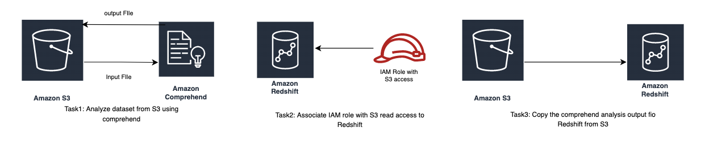

# JAM Você consegue entender o sentimento do seu cliente...

```wasm
**Você consegue entender o sentimento do seu cliente...**
Selecione um desafio abaixo para começar.**Iniciar o desafio
Visão geral**
A
Awesome Products Inc. é uma empresa de comércio eletrônico que vende uma ampla gama de produtos de consumo. Os clientes que compram produtos da Awesome Products Inc. têm a opção de adicionar avaliações e classificações para os produtos que compraram para ajudar outros clientes a encontrar os produtos de qualidade certos. Como a empresa cresceu exponencialmente nos últimos tempos, cada produto tem um grande número de avaliações que são carregadas em um bucket do Amazon S3.

A gerência da empresa quer entender como os produtos estão se saindo no mercado e se eles estão atendendo às necessidades do cliente. No entanto, não é possível que eles analisem as avaliações manualmente.
Você foi recentemente contratado como engenheiro de análise de dados para derivar o sentimento do cliente a partir das análises de produtos que estão disponíveis no bucket do S3. Os dados analisados precisam ser armazenados em uma tabela do Amazon Redshift para ajudar a gerência da empresa a realizar análises e relatórios históricos.
**Arquitetura de tarefas**
! [Arquitetura de tarefas](https://aws-jam-challenge-resources.s3.amazonaws.com/nlp-sentiment-analysis/Summary.png)**Leia menos**Você consegue entender o sentimento do seu cliente...
```



TASK 1:

```wasm
Você consegue entender o sentimento do seu cliente?
Selecione um desafio abaixo para começar.

Resolva usando:

Abra o console da AWS
>_AWS_CLI
Reiniciar o desafio
Propriedades de saída

Seu desafio está pronto!
Tudo de bom, e lembre-se de se divertir!

Tarefa 1: Analise o sentimento para cada avaliação
Pontos possíveis
32
Penalidade por pista
0
Pontos disponíveis
32
Verifique meu progresso

Tarefas e pistas
Enviar resposta
Plano de fundo
A equipe de análise precisa consolidar as avaliações dos clientes e realizar análises de sentimentos. Como você foi encarregado de obter os insights de sentimento das avaliações do produto você precisa executar um trabalho de análise do Amazon Comprehend que cria uma saída arquivo com os dados da análise.

Sua tarefa
Um arquivo de texto contendo avaliações de clientes sobre um produto está disponível no nome do bucket do S3 prefixado com s3productreview. Use isso como um arquivo de entrada para criar o arquivo de saída com detalhes do sentimento para cada avaliação do produto usando o trabalho de análise do Amazon Comprehend. O arquivo de saída deve ser criado no mesmo bucket do S3. Depois que o arquivo de saída é criado, a tarefa é completo.

Inventário
Sua conta da AWS é provisionada com o seguinte:
- Bucket S3 prefixado com: s3productreview

Arquivo de avaliação do produto dentro do bucket do S3
Função do IAM S3AccessRoleComprehend
Permissões mínimas necessárias para você concluir esta tarefa
Começando
Navegue até o console do S3 e identifique o bucket e o arquivo necessários para essa tarefa. Copie o URI S3 do arquivo e siga em frente ao Amazon Comprehend Console para criar um trabalho de análise de sentimentos com o identificou o arquivo S3 como entrada.

Para dados de saída, especifique o mesmo valor de bucket do S3 sem nenhum nome de objeto.

Serviços envolvidos
Amazon S3
Amazon Comprehend
Validação de tarefas
Quando o trabalho de análise do Amazon Comprehend for concluído com êxito, insira o nome do trabalho de análise no campo localizado no no topo desta página que diz Enter answer here e clique em enviar para obter o crédito.

Pistas
A documentação é a chave!
3Pontos de penalidade
Desbloqueie o Clue
Criando um trabalho de análise de sentimento
4Pontos de penalidade
Desbloqueie o Clue
Etapas detalhadas para realizar a tarefa
4Pontos de penalidade
Desbloqueie o Clue
```

peguei as dicas, nao estava entendo nada, o que e amazon cumprehead, nao sabia o que era um URI, mas e de um poroduto especifico, por que que no primeiro tem que colocar ocm o objeo e a segunda nao?

pistas:

```wasm
Pistas
A documentação é a chave!
3Pontos de penalidade
Mostrar pista
Criando um trabalho de análise de sentimento
4Pontos de penalidade
Ocultar pista
Criando um trabalho de análise de sentimentos

- Navegue até o console S3 e encontre o bucket prefixado com s3productreview. Clique no objeto s3 324526-product-reviews.txt e copie o URI do S3.

Em seguida, navegue até o console Comprehend, crie um trabalho de análise com o tipo Análise como Sentimento.
Cole o uri do S3 que você copiou da etapa 1 no local S3 da seção Dados de entrada.
Use o mesmo bucket do S3 que o nome do bucket sem o nome do objeto na seção Dados de saída.
Escolha a função existente do IAM S3AccessRoleComprehend, deixe outras opções como padrão e crie o trabalho.
Consulte a seguinte documentação da AWS para entender como criar um trabalho de análise dentro do console Amazon Comprehend.

Trabalho de análise do Amazon Comprehend

Etapas detalhadas para realizar a tarefa
4Pontos de penalidade
Desbloqueie o Clue
```

pedi dicas, precisava so agurdar, eu queria saber por que no primeiro tinha que deixar com o URI e o outro do com  URI/O.TXT, por que?

task2:

```wasm
Você consegue entender o sentimento do seu cliente?
Selecione um desafio abaixo para começar.

Resolva usando:

Abra o console da AWS
>_AWS_CLI
Reiniciar o desafio
Propriedades de saída

Seu desafio está pronto!
Tudo de bom, e lembre-se de se divertir!

Tarefa 2: Prepare-se para carregar os dados no banco de dados com uma função do IAM
Pontos possíveis
16
Penalidade por pista
0
Pontos disponíveis
16
Verifique meu progresso

Tarefas e pistas
Plano de fundo
Parabéns por criar com sucesso o trabalho de análise de sentimentos. A equipe está feliz porque estamos um passo mais perto de obter os resultados. O trabalho do Amazon Comprehend agora está concluído e a saída está disponível no mesmo bucket do S3. Os dados analisados precisam ser carregados em uma tabela do Amazon Reshift para ajudar a gerência da empresa a realizar análises e relatórios históricos. Antes de carregar os dados de saída no Redshift Cluster, as permissões necessárias para que o cluster acesse os dados no bucket do S3 precisam estar estabelecidas.

Sua tarefa
Associe a função IAM criada que permitirá o Redshift cluster para acessar objetos do S3. Ignore os erros no console do Amazon Redshift.

Inventário
Sua conta da AWS é provisionada com o seguinte:
- Bucket S3 prefixado com: s3productreview

Cluster Redshift
Função IAM S3AccessRoleRedshift
Permissões mínimas necessárias para você concluir esta tarefa
Verifique a guia output properties à esquerda para ver os detalhes do identificador do cluster Redshift.

Começando
Navegue até o console do IAM e crie uma função do IAM para o Redshift Service com os privilégios necessários para acessar seu bucket do S3.

Serviços envolvidos
Amazon Redshift
ERA O OBJETIVO
Validação de tarefas
Depois que a função do IAM for associada ao cluster do Redshift, a tarefa será automaticamente validada para conclusão. Como alternativa, você pode clicar em Check my Progress para verificar o status.

Pistas
Função do IAM para serviços da AWS
1Pontos de penalidade
Desbloqueie o Clue
Criação da função do IAM
2Pontos de penalidade
Desbloqueie o Clue
Etapas detalhadas para criar a função do IAM
2Pontos de penalidade
Desbloqueie o Clue
```

sinceramente nao to conseguindo fazer sem a IA e sem as dicas

eu usei todas as dicas para terminar o desafio logo

eu to desapontado

task 3:

```wasm
Você consegue entender o sentimento do seu cliente?
Selecione um desafio abaixo para começar.

Resolva usando:

Abra o console da AWS
>_AWS_CLI
Reiniciar o desafio
Propriedades de saída

Seu desafio está pronto!
Tudo de bom, e lembre-se de se divertir!

Tarefa 2: Prepare-se para carregar os dados no banco de dados com uma função do IAM
Pontos possíveis
16
Penalidade por pista
5
Pontos disponíveis
11
Verifique meu progresso

Tarefas e pistas
Plano de fundo
Parabéns por criar com sucesso o trabalho de análise de sentimentos. A equipe está feliz porque estamos um passo mais perto de obter os resultados. O trabalho do Amazon Comprehend agora está concluído e a saída está disponível no mesmo bucket do S3. Os dados analisados precisam ser carregados em uma tabela do Amazon Reshift para ajudar a gerência da empresa a realizar análises e relatórios históricos. Antes de carregar os dados de saída no Redshift Cluster, as permissões necessárias para que o cluster acesse os dados no bucket do S3 precisam estar estabelecidas.

Sua tarefa
Associe a função IAM criada que permitirá o Redshift cluster para acessar objetos do S3. Ignore os erros no console do Amazon Redshift.

Inventário
Sua conta da AWS é provisionada com o seguinte:
- Bucket S3 prefixado com: s3productreview

Cluster Redshift
Função IAM S3AccessRoleRedshift
Permissões mínimas necessárias para você concluir esta tarefa
Verifique a guia output properties à esquerda para ver os detalhes do identificador do cluster Redshift.

Começando
Navegue até o console do IAM e crie uma função do IAM para o Redshift Service com os privilégios necessários para acessar seu bucket do S3.

Serviços envolvidos
Amazon Redshift
ERA O OBJETIVO
Validação de tarefas
Depois que a função do IAM for associada ao cluster do Redshift, a tarefa será automaticamente validada para conclusão. Como alternativa, você pode clicar em Check my Progress para verificar o status.

Pistas
Função do IAM para serviços da AWS
1Pontos de penalidade
Ocultar pista
Consulte a seguinte documentação da AWS para entender como isso pode ser feito.

Autorizando o Redshift a acessar o S3

Criação da função do IAM
2Pontos de penalidade
Ocultar pista
Função do IAM para o Redshift Cluster

Associe a função IAM S3AccessRoleRedshift ao Redshift Cluster no Redshift Console em Cluster Permissions.
Consulte a seguinte documentação da AWS para entender como isso pode ser feito.

Autorizando o Redshift a acessar o S3

Etapas detalhadas para criar a função do IAM
2Pontos de penalidade
Ocultar pista
Siga as etapas abaixo para realizar a tarefa

Navegue até o Redshift Console (ignore quaisquer erros no banner), clique no cluster Redshift em Visão geral do cluster. Você verá um único cluster criado para esse desafio. Se você não vê esse cluster, certifique-se de ter selecionado a região correta, que será exibida no painel inferior do painel do desafio, conforme mostrado abaixo. ! Região

Selecione a guia Propriedades no canto superior direito e role para baixo até a seção Funções associadas do IAM (ignore os erros mostrados no banner).

Clique na opção Associar função do IAM e selecione a função do IAM S3AccessRoleRedshift.

Uma vez concluída, a tarefa será automaticamente validada. Ignore os erros no console do Redshift.

Consulte a seguinte documentação da AWS para entender como isso pode ser feito.

Autorizando o Redshift a acessar o S3
```

eu ja nao sei como fazer to so pegando as dicas 

[](data:image/svg+xml;base64,PD94bWwgdmVyc2lvbj0iMS4wIiBlbmNvZGluZz0iVVRGLTgiPz4KPHN2ZyB3aWR0aD0iMTZweCIgaGVpZ2h0PSIxNnB4IiB2aWV3Qm94PSIwIDAgMTYgMTYiIHZlcnNpb249IjEuMSIgeG1sbnM9Imh0dHA6Ly93d3cudzMub3JnLzIwMDAvc3ZnIiB4bWxuczp4bGluaz0iaHR0cDovL3d3dy53My5vcmcvMTk5OS94bGluayI+CiAgICA8IS0tIEdlbmVyYXRvcjogU2tldGNoIDY0ICg5MzUzNykgLSBodHRwczovL3NrZXRjaC5jb20gLS0+CiAgICA8dGl0bGU+YXdzdWkgLyBpY29ucyAvIGFjdGlvbnMgLyBkZWZhdWx0IC8gdW5kbzwvdGl0bGU+CiAgICA8ZGVzYz5DcmVhdGVkIHdpdGggU2tldGNoLjwvZGVzYz4KICAgIDxnIGlkPSJ1bmRvLTIiIHN0cm9rZT0ibm9uZSIgc3Ryb2tlLXdpZHRoPSIxIiBmaWxsPSJub25lIiBmaWxsLXJ1bGU9ImV2ZW5vZGQiPgogICAgICAgIDxwYXRoIGQ9Ik0xNS4wODg2MTUsMi4xODM5NDU2NiBMMTUuMDg4NjE1LDcuMjE5NDU4MDEgTDEwLjA4ODMwMjIsNy4yMTk0NTgwMSBMMTAuMDg4MzAyMiw2LjE4Mzk0NTY2IEwxMy4yNzUwNzExLDYuMTgyNjI5MTEgQzEyLjUwMjM1MTEsNS4zOTcyNTQ3OCAxMS41MDQzMjE5LDQuODE1MjMzMTYgMTAuMzUxMjU4Myw0LjU0OTAyNzQ1IEM3LjEyMjQ3OTksMy44MDM2MDUyMiAzLjkwMDc1Mzc3LDUuODE2NzYzMTQgMy4xNTUzMzE1NSw5LjA0NTU0MTUxIEMyLjk1NDgyOTA0LDkuOTE0MDEzMjkgMi45NTM5MDgxNSwxMC43ODE5NzQ4IDMuMTIyNTQyMjQsMTEuNjAxMzczNSBMMi4xODIwNDM4MiwxMS45ODE1NTI3IEMxLjk0Njc0ODQsMTAuOTczNDI2MyAxLjkzMjM3MzIyLDkuODk3MzQ0NTEgMi4xODA5NjE0OCw4LjgyMDU5MDQ1IEMzLjA1MDYyMDc0LDUuMDUzNjgyMzYgNi44MDkzMDEyMiwyLjcwNDk5ODEyIDEwLjU3NjIwOTMsMy41NzQ2NTczOCBDMTEuOTcyODc0MSwzLjg5NzEwMjg1IDEzLjE3NDU3MjcsNC42MTY3MDc4OSAxNC4wODk1NTE4LDUuNTg2NjM2MTQgTDE0LjA4ODMwMjIsMi4xODM5NDU2NiBMMTUuMDg4NjE1LDIuMTgzOTQ1NjYgWiIgaWQ9IkNvbWJpbmVkLVNoYXBlIiBmaWxsPSIjMDAwMDAwIiB0cmFuc2Zvcm09InRyYW5zbGF0ZSg4LjU0NDMwNywgNy4wODI3NDkpIHNjYWxlKC0xLCAxKSB0cmFuc2xhdGUoLTguNTQ0MzA3LCAtNy4wODI3NDkpICI+PC9wYXRoPgogICAgPC9nPgo8L3N2Zz4K)

[](data:image/svg+xml;base64,PD94bWwgdmVyc2lvbj0iMS4wIiBlbmNvZGluZz0iVVRGLTgiPz4KPHN2ZyB3aWR0aD0iMTZweCIgaGVpZ2h0PSIxNnB4IiB2aWV3Qm94PSIwIDAgMTYgMTYiIHZlcnNpb249IjEuMSIgeG1sbnM9Imh0dHA6Ly93d3cudzMub3JnLzIwMDAvc3ZnIiB4bWxuczp4bGluaz0iaHR0cDovL3d3dy53My5vcmcvMTk5OS94bGluayI+CiAgICA8IS0tIEdlbmVyYXRvcjogU2tldGNoIDY0ICg5MzUzNykgLSBodHRwczovL3NrZXRjaC5jb20gLS0+CiAgICA8dGl0bGU+YXdzdWkgLyBpY29ucyAvIGFjdGlvbnMgLyBkZWZhdWx0IC8gcmVkbzwvdGl0bGU+CiAgICA8ZGVzYz5DcmVhdGVkIHdpdGggU2tldGNoLjwvZGVzYz4KICAgIDxnIGlkPSJyZWRvLTIiIHN0cm9rZT0ibm9uZSIgc3Ryb2tlLXdpZHRoPSIxIiBmaWxsPSJub25lIiBmaWxsLXJ1bGU9ImV2ZW5vZGQiPgogICAgICAgIDxwYXRoIGQ9Ik0xNS4wODg2MTUsMi4xODM5NDU2NiBMMTUuMDg4NjE1LDcuMjE5NDU4MDEgTDEwLjA4ODMwMjIsNy4yMTk0NTgwMSBMMTAuMDg4MzAyMiw2LjE4Mzk0NTY2IEwxMy4yNzUwNzExLDYuMTgyNjI5MTEgQzEyLjUwMjM1MTEsNS4zOTcyNTQ3OCAxMS41MDQzMjE5LDQuODE1MjMzMTYgMTAuMzUxMjU4Myw0LjU0OTAyNzQ1IEM3LjEyMjQ3OTksMy44MDM2MDUyMiAzLjkwMDc1Mzc3LDUuODE2NzYzMTQgMy4xNTUzMzE1NSw5LjA0NTU0MTUxIEMyLjk1NDgyOTA0LDkuOTE0MDEzMjkgMi45NTM5MDgxNSwxMC43ODE5NzQ4IDMuMTIyNTQyMjQsMTEuNjAxMzczNSBMMi4xODIwNDM4MiwxMS45ODE1NTI3IEMxLjk0Njc0ODQsMTAuOTczNDI2MyAxLjkzMjM3MzIyLDkuODk3MzQ0NTEgMi4xODA5NjE0OCw4LjgyMDU5MDQ1IEMzLjA1MDYyMDc0LDUuMDUzNjgyMzYgNi44MDkzMDEyMiwyLjcwNDk5ODEyIDEwLjU3NjIwOTMsMy41NzQ2NTczOCBDMTEuOTcyODc0MSwzLjg5NzEwMjg1IDEzLjE3NDU3MjcsNC42MTY3MDc4OSAxNC4wODk1NTE4LDUuNTg2NjM2MTQgTDE0LjA4ODMwMjIsMi4xODM5NDU2NiBMMTUuMDg4NjE1LDIuMTgzOTQ1NjYgWiIgaWQ9IkNvbWJpbmVkLVNoYXBlIiBmaWxsPSIjMDAwMDAwIj48L3BhdGg+CiAgICA8L2c+Cjwvc3ZnPgo=)

[](data:image/svg+xml;base64,PD94bWwgdmVyc2lvbj0iMS4wIiBlbmNvZGluZz0iVVRGLTgiPz4KPHN2ZyB3aWR0aD0iMTdweCIgaGVpZ2h0PSIxN3B4IiB2aWV3Qm94PSIwIDAgMTcgMTciIHZlcnNpb249IjEuMSIgeG1sbnM9Imh0dHA6Ly93d3cudzMub3JnLzIwMDAvc3ZnIiB4bWxuczp4bGluaz0iaHR0cDovL3d3dy53My5vcmcvMTk5OS94bGluayI+CiAgICA8IS0tIEdlbmVyYXRvcjogU2tldGNoIDUxLjMgKDU3NTQ0KSAtIGh0dHA6Ly93d3cuYm9oZW1pYW5jb2RpbmcuY29tL3NrZXRjaCAtLT4KICAgIDx0aXRsZT5APC90aXRsZT4KICAgIDxkZXNjPkNyZWF0ZWQgd2l0aCBTa2V0Y2guPC9kZXNjPgogICAgPGRlZnM+PC9kZWZzPgogICAgPGcgaWQ9IlN5bWJvbHMiIHN0cm9rZT0ibm9uZSIgc3Ryb2tlLXdpZHRoPSIxIiBmaWxsPSJub25lIiBmaWxsLXJ1bGU9ImV2ZW5vZGQiIGZvbnQtZmFtaWx5PSJBbWF6b25FbWJlci1Cb2xkLCBBbWF6b24gRW1iZXIiIGZvbnQtc2l6ZT0iMTgiIGZvbnQtd2VpZ2h0PSJib2xkIiBsZXR0ZXItc3BhY2luZz0iMC4wNjU0NTQ1NiIgbGluZS1zcGFjaW5nPSIyMCI+CiAgICAgICAgPGcgaWQ9IlF1ZXJ5LUVkaXRvci9FZGl0b3IiIHRyYW5zZm9ybT0idHJhbnNsYXRlKC05MjAuMDAwMDAwLCAtOTEuMDAwMDAwKSIgZmlsbD0iIzU0NUI2NCI+CiAgICAgICAgICAgIDxnIGlkPSJRdWVyeS1FZGl0b3IiPgogICAgICAgICAgICAgICAgPHRleHQgaWQ9IkAiPgogICAgICAgICAgICAgICAgICAgIDx0c3BhbiB4PSI5MjAiIHk9IjEwNSI+QDwvdHNwYW4+CiAgICAgICAgICAgICAgICA8L3RleHQ+CiAgICAgICAgICAgIDwvZz4KICAgICAgICA8L2c+CiAgICA8L2c+Cjwvc3ZnPg==)

[](data:image/svg+xml;base64,PD94bWwgdmVyc2lvbj0iMS4wIiBlbmNvZGluZz0iVVRGLTgiPz4KPHN2ZyB3aWR0aD0iMTZweCIgaGVpZ2h0PSIxNnB4IiB2aWV3Qm94PSIwIDAgMTYgMTYiIHZlcnNpb249IjEuMSIgeG1sbnM9Imh0dHA6Ly93d3cudzMub3JnLzIwMDAvc3ZnIiB4bWxuczp4bGluaz0iaHR0cDovL3d3dy53My5vcmcvMTk5OS94bGluayI+CiAgICA8IS0tIEdlbmVyYXRvcjogU2tldGNoIDUxLjMgKDU3NTQ0KSAtIGh0dHA6Ly93d3cuYm9oZW1pYW5jb2RpbmcuY29tL3NrZXRjaCAtLT4KICAgIDx0aXRsZT5hd3N1aSAvIGljb25zIC8gYWN0aW9ucyAvIGRlZmF1bHQgLyBmb3JtYXQtb21pdDwvdGl0bGU+CiAgICA8ZGVzYz5DcmVhdGVkIHdpdGggU2tldGNoLjwvZGVzYz4KICAgIDxkZWZzPgogICAgICAgIDxwYXRoIGQ9Ik00LjA2NTc2MjczLDguMjU2MjU1MjggTDIsNi4xOTA0OTI1NSBMMy4xOTA0OTI1NSw1IEw2LjM4ODUwMzE1LDguMTk4MDEwNiBMNi4zNjY1ODg2MSw4LjIxOTkyNTE1IEw2LjQyNDgzMzI4LDguMjc4MTY5ODIgTDMuMjI2ODIyNjcsMTEuNDc2MTgwNCBMMi4wMzYzMzAxMywxMC4yODU2ODc5IEw0LjA2NTc2MjczLDguMjU2MjU1MjggWiBNMCwwIEwxNiwwIEwxNiwyIEwwLDIgTDAsMCBaIE04LDQuNjY2NjY2NjcgTDE2LDQuNjY2NjY2NjcgTDE2LDYuNjY2NjY2NjcgTDgsNi42NjY2NjY2NyBMOCw0LjY2NjY2NjY3IFogTTgsOS4zMzMzMzMzMyBMMTYsOS4zMzMzMzMzMyBMMTYsMTEuMzMzMzMzMyBMOCwxMS4zMzMzMzMzIEw4LDkuMzMzMzMzMzMgWiBNMCwxNCBMMTYsMTQgTDE2LDE2IEwwLDE2IEwwLDE0IFoiIGlkPSJwYXRoLTEiPjwvcGF0aD4KICAgIDwvZGVmcz4KICAgIDxnIGlkPSJhd3N1aS0vLWljb25zLS8tYWN0aW9ucy0vLWRlZmF1bHQtLy1mb3JtYXQtb21pdCIgc3Ryb2tlPSJub25lIiBzdHJva2Utd2lkdGg9IjEiIGZpbGw9Im5vbmUiIGZpbGwtcnVsZT0iZXZlbm9kZCI+CiAgICAgICAgPG1hc2sgaWQ9Im1hc2stMiIgZmlsbD0id2hpdGUiPgogICAgICAgICAgICA8dXNlIHhsaW5rOmhyZWY9IiNwYXRoLTEiPjwvdXNlPgogICAgICAgIDwvbWFzaz4KICAgICAgICA8dXNlIGlkPSJDb21iaW5lZC1TaGFwZSIgZmlsbD0iI0Q4RDhEOCIgeGxpbms6aHJlZj0iI3BhdGgtMSI+PC91c2U+CiAgICAgICAgPGcgaWQ9ImF3c3VpLS8taWNvbnMtLy1jb2xvcnMtLy1ub3JtYWwtb21pdCIgbWFzaz0idXJsKCNtYXNrLTIpIiBmaWxsPSIjMTYxOTFGIj4KICAgICAgICAgICAgPHJlY3QgaWQ9IlJlY3RhbmdsZSIgeD0iMCIgeT0iMCIgd2lkdGg9IjE2IiBoZWlnaHQ9IjE2Ij48L3JlY3Q+CiAgICAgICAgPC9nPgogICAgPC9nPgo8L3N2Zz4=)

[](data:image/svg+xml;base64,PD94bWwgdmVyc2lvbj0iMS4wIiBlbmNvZGluZz0iVVRGLTgiPz4KPHN2ZyB3aWR0aD0iMTZweCIgaGVpZ2h0PSIxNnB4IiB2aWV3Qm94PSIwIDAgMTYgMTYiIHZlcnNpb249IjEuMSIgeG1sbnM9Imh0dHA6Ly93d3cudzMub3JnLzIwMDAvc3ZnIiB4bWxuczp4bGluaz0iaHR0cDovL3d3dy53My5vcmcvMTk5OS94bGluayI+CiAgICA8IS0tIEdlbmVyYXRvcjogU2tldGNoIDUxLjMgKDU3NTQ0KSAtIGh0dHA6Ly93d3cuYm9oZW1pYW5jb2RpbmcuY29tL3NrZXRjaCAtLT4KICAgIDx0aXRsZT5hd3N1aSAvIGljb25zIC8gYWN0aW9ucyAvIGRlZmF1bHQgLyBjb21tZW50Y29kZS1vbWl0IGNvcHk8L3RpdGxlPgogICAgPGRlc2M+Q3JlYXRlZCB3aXRoIFNrZXRjaC48L2Rlc2M+CiAgICA8ZGVmcz4KICAgICAgICA8cGF0aCBkPSJNMTEuNzYxMzM1LDcuMjA3MTA2NzggTDExLjc2MTMzNSwxMCBMMTAuNzYxMzM1LDEwIEwxMC43NjEzMzUsNy4yMDcxMDY3OCBMOC43ODY0NjEyNSw5LjE4MTk4MDUyIEw4LjA3OTM1NDQ3LDguNDc0ODczNzMgTDEwLjA1NDIyODIsNi41IEw3LjI2MTMzNDk4LDYuNSBMNy4yNjEzMzQ5OCw1LjUgTDEwLjA1NDIyODIsNS41IEw4LjA3OTM1NDQ3LDMuNTI1MTI2MjcgTDguNzg2NDYxMjUsMi44MTgwMTk0OCBMMTAuNzYxMzM1LDQuNzkyODkzMjIgTDEwLjc2MTMzNSwyIEwxMS43NjEzMzUsMiBMMTEuNzYxMzM1LDQuNzkyODkzMjIgTDEzLjczNjIwODcsMi44MTgwMTk0OCBMMTQuNDQzMzE1NSwzLjUyNTEyNjI3IEwxMi40Njg0NDE4LDUuNSBMMTUuMjYxMzM1LDUuNSBMMTUuMjYxMzM1LDYuNSBMMTIuNDY4NDQxOCw2LjUgTDE0LjQ0MzMxNTUsOC40NzQ4NzM3MyBMMTMuNzM2MjA4Nyw5LjE4MTk4MDUyIEwxMS43NjEzMzUsNy4yMDcxMDY3OCBaIE0xLDE0LjEzNDcxNCBMNS45MTA3NTg1NSwwLjY0MjUxNTc4OSBMNy4xNzc1OTc4LDEuMTAzNjA3NTcgTDIuMjY2ODM5MjUsMTQuNTk1ODA1OCBMMSwxNC4xMzQ3MTQgWiIgaWQ9InBhdGgtMSI+PC9wYXRoPgogICAgPC9kZWZzPgogICAgPGcgaWQ9ImF3c3VpLS8taWNvbnMtLy1hY3Rpb25zLS8tZGVmYXVsdC0vLWNvbW1lbnRjb2RlLW9taXQtY29weSIgc3Ryb2tlPSJub25lIiBzdHJva2Utd2lkdGg9IjEiIGZpbGw9Im5vbmUiIGZpbGwtcnVsZT0iZXZlbm9kZCI+CiAgICAgICAgPG1hc2sgaWQ9Im1hc2stMiIgZmlsbD0id2hpdGUiPgogICAgICAgICAgICA8dXNlIHhsaW5rOmhyZWY9IiNwYXRoLTEiPjwvdXNlPgogICAgICAgIDwvbWFzaz4KICAgICAgICA8dXNlIGlkPSJDb21iaW5lZC1TaGFwZSIgZmlsbD0iI0Q4RDhEOCIgeGxpbms6aHJlZj0iI3BhdGgtMSI+PC91c2U+CiAgICAgICAgPGcgaWQ9ImF3c3VpLS8taWNvbnMtLy1jb2xvcnMtLy1ub3JtYWwtb21pdCIgbWFzaz0idXJsKCNtYXNrLTIpIiBmaWxsPSIjMTYxOTFGIj4KICAgICAgICAgICAgPHJlY3QgaWQ9IlJlY3RhbmdsZSIgeD0iMCIgeT0iMCIgd2lkdGg9IjE2IiBoZWlnaHQ9IjE2Ij48L3JlY3Q+CiAgICAgICAgPC9nPgogICAgPC9nPgo8L3N2Zz4=)

[](data:image/svg+xml;base64,PD94bWwgdmVyc2lvbj0iMS4wIiBlbmNvZGluZz0iVVRGLTgiPz4KPHN2ZyB3aWR0aD0iMTZweCIgaGVpZ2h0PSIxNnB4IiB2aWV3Qm94PSIwIDAgMTYgMTYiIHZlcnNpb249IjEuMSIgeG1sbnM9Imh0dHA6Ly93d3cudzMub3JnLzIwMDAvc3ZnIiB4bWxuczp4bGluaz0iaHR0cDovL3d3dy53My5vcmcvMTk5OS94bGluayI+CiAgICA8IS0tIEdlbmVyYXRvcjogU2tldGNoIDUxLjMgKDU3NTQ0KSAtIGh0dHA6Ly93d3cuYm9oZW1pYW5jb2RpbmcuY29tL3NrZXRjaCAtLT4KICAgIDx0aXRsZT5hd3N1aSAvIGljb25zIC8gYWN0aW9ucyAvIGRlZmF1bHQgLyBrZXlib2FyZC1vbWl0PC90aXRsZT4KICAgIDxkZXNjPkNyZWF0ZWQgd2l0aCBTa2V0Y2guPC9kZXNjPgogICAgPGRlZnM+CiAgICAgICAgPHBhdGggZD0iTTEsMiBMMTUsMiBDMTUuNTUyMjg0NywyIDE2LDIuNDQ3NzE1MjUgMTYsMyBMMTYsMTMgQzE2LDEzLjU1MjI4NDcgMTUuNTUyMjg0NywxNCAxNSwxNCBMMSwxNCBDMC40NDc3MTUyNSwxNCA2Ljc2MzUzNzUxZS0xNywxMy41NTIyODQ3IDAsMTMgTDAsMyBDLTYuNzYzNTM3NTFlLTE3LDIuNDQ3NzE1MjUgMC40NDc3MTUyNSwyIDEsMiBaIE0xLjUsNCBMMS41LDYgTDQsNiBMNCw0IEwxLjUsNCBaIE0xLjUsNyBMMS41LDkgTDQsOSBMNCw3IEwxLjUsNyBaIE01LDQgTDUsNiBMNy41LDYgTDcuNSw0IEw1LDQgWiBNNSw3IEw1LDkgTDcuNSw5IEw3LjUsNyBMNSw3IFogTTguNSw0IEw4LjUsNiBMMTEsNiBMMTEsNCBMOC41LDQgWiBNOC41LDcgTDguNSw5IEwxMSw5IEwxMSw3IEw4LjUsNyBaIE0xMiw0IEwxMiw2IEwxNC41LDYgTDE0LjUsNCBMMTIsNCBaIE0xMiw3IEwxMiw5IEwxNC41LDkgTDE0LjUsNyBMMTIsNyBaIE0zLDEwIEwzLDEyIEwxMywxMiBMMTMsMTAgTDMsMTAgWiIgaWQ9InBhdGgtMSI+PC9wYXRoPgogICAgPC9kZWZzPgogICAgPGcgaWQ9ImF3c3VpLS8taWNvbnMtLy1hY3Rpb25zLS8tZGVmYXVsdC0vLWtleWJvYXJkLW9taXQiIHN0cm9rZT0ibm9uZSIgc3Ryb2tlLXdpZHRoPSIxIiBmaWxsPSJub25lIiBmaWxsLXJ1bGU9ImV2ZW5vZGQiPgogICAgICAgIDxtYXNrIGlkPSJtYXNrLTIiIGZpbGw9IndoaXRlIj4KICAgICAgICAgICAgPHVzZSB4bGluazpocmVmPSIjcGF0aC0xIj48L3VzZT4KICAgICAgICA8L21hc2s+CiAgICAgICAgPHVzZSBpZD0iQ29tYmluZWQtU2hhcGUiIGZpbGw9IiNEMDAyMUIiIHhsaW5rOmhyZWY9IiNwYXRoLTEiPjwvdXNlPgogICAgICAgIDxnIGlkPSJhd3N1aS0vLWljb25zLS8tY29sb3JzLS8tbm9ybWFsLW9taXQiIG1hc2s9InVybCgjbWFzay0yKSIgZmlsbD0iIzE2MTkxRiI+CiAgICAgICAgICAgIDxyZWN0IGlkPSJSZWN0YW5nbGUiIHg9IjAiIHk9IjAiIHdpZHRoPSIxNiIgaGVpZ2h0PSIxNiI+PC9yZWN0PgogICAgICAgIDwvZz4KICAgIDwvZz4KPC9zdmc+)

1

```
 copy feedback.product_feedback
```

2

```
  from 's3://s3productreview-us-east-1-866451573049/324526-product-reviews.txt'
```

3

```
   iam_role 'S3AccessRoleRedshift'
```

4

```
    json 'auto ignorecase';
```

5

```

```

**Executar**

**Save**

**Schedule**

**Clear**

**Enviar feedback**

[](data:image/svg+xml;base64,PD94bWwgdmVyc2lvbj0iMS4wIiBlbmNvZGluZz0iVVRGLTgiPz4KPHN2ZyB3aWR0aD0iMTZweCIgaGVpZ2h0PSIxNnB4IiB2aWV3Qm94PSIwIDAgMTYgMTYiIHZlcnNpb249IjEuMSIgeG1sbnM9Imh0dHA6Ly93d3cudzMub3JnLzIwMDAvc3ZnIiB4bWxuczp4bGluaz0iaHR0cDovL3d3dy53My5vcmcvMTk5OS94bGluayI+CiAgICA8IS0tIEdlbmVyYXRvcjogU2tldGNoIDUxLjMgKDU3NTQ0KSAtIGh0dHA6Ly93d3cuYm9oZW1pYW5jb2RpbmcuY29tL3NrZXRjaCAtLT4KICAgIDx0aXRsZT5hd3N1aSAvIGljb25zIC8gYWN0aW9ucyAvIGRlZmF1bHQgLyBmZWVkYmFjay1vbWl0PC90aXRsZT4KICAgIDxkZXNjPkNyZWF0ZWQgd2l0aCBTa2V0Y2guPC9kZXNjPgogICAgPGRlZnM+CiAgICAgICAgPHBhdGggZD0iTTEuMTQyODU3MTQsMCBMMTQuODU3MTQyOSwwIEMxNS40ODgzMjU0LDAgMTYsMC4zMTk3OTY2MDcgMTYsMC43MTQyODU3MTQgTDE2LDkuMjg1NzE0MjkgQzE2LDkuNjgwMjAzMzkgMTUuNDg4MzI1NCwxMCAxNC44NTcxNDI5LDEwIEw4LjA0ODExNzE3LDEwIEw5LjAxOTQ2MjkzLDE1LjY3NjYxNDUgTDEuOTc5NDQzOTgsMTAgTDEuMTQyODU3MTQsMTAgQzAuNTExNjc0NTcyLDEwIDAsOS42ODAyMDMzOSAwLDkuMjg1NzE0MjkgTDAsMC43MTQyODU3MTQgQzAsMC4zMTk3OTY2MDcgMC41MTE2NzQ1NzIsMCAxLjE0Mjg1NzE0LDAgWiIgaWQ9InBhdGgtMSI+PC9wYXRoPgogICAgPC9kZWZzPgogICAgPGcgaWQ9ImF3c3VpLS8taWNvbnMtLy1hY3Rpb25zLS8tZGVmYXVsdC0vLWZlZWRiYWNrLW9taXQiIHN0cm9rZT0ibm9uZSIgc3Ryb2tlLXdpZHRoPSIxIiBmaWxsPSJub25lIiBmaWxsLXJ1bGU9ImV2ZW5vZGQiPgogICAgICAgIDxtYXNrIGlkPSJtYXNrLTIiIGZpbGw9IndoaXRlIj4KICAgICAgICAgICAgPHVzZSB4bGluazpocmVmPSIjcGF0aC0xIj48L3VzZT4KICAgICAgICA8L21hc2s+CiAgICAgICAgPHVzZSBpZD0iQ29tYmluZWQtU2hhcGUiIGZpbGw9IiM0NDQ0NDQiIHhsaW5rOmhyZWY9IiNwYXRoLTEiPjwvdXNlPgogICAgICAgIDxnIGlkPSJhd3N1aS0vLWljb25zLS8tY29sb3JzLS8tbm9ybWFsLW9taXQiIG1hc2s9InVybCgjbWFzay0yKSIgZmlsbD0iIzAwNzNiYiI+CiAgICAgICAgICAgIDxyZWN0IGlkPSJSZWN0YW5nbGUiIHg9IjAiIHk9IjAiIHdpZHRoPSIxNiIgaGVpZ2h0PSIxNiI+PC9yZWN0PgogICAgICAgIDwvZz4KICAgIDwvZz4KPC9zdmc+Cg==)

[**Resultados da consultaDetalhes da tabela**](https://us-east-1.console.aws.amazon.com/redshiftv2/home?region=us-east-1#)

- [**Resultados da consulta**](https://us-east-1.console.aws.amazon.com/redshiftv2/home?region=us-east-1#)
- [**Detalhes da tabela**](https://us-east-1.console.aws.amazon.com/redshiftv2/home?region=us-east-1#)

**Consulta [8704](https://us-east-1.console.aws.amazon.com/redshiftv2/home?region=us-east-1#/query?cluster=redshiftcluster-emr1mvfilclc&query=8704)**

**ExecuçãoDadosVisualizar**

[](data:image/svg+xml;base64,PD94bWwgdmVyc2lvbj0iMS4wIiBlbmNvZGluZz0iVVRGLTgiPz4KPHN2ZyB3aWR0aD0iMTZweCIgaGVpZ2h0PSIxNnB4IiB2aWV3Qm94PSIwIDAgMTYgMTYiIHZlcnNpb249IjEuMSIgeG1sbnM9Imh0dHA6Ly93d3cudzMub3JnLzIwMDAvc3ZnIiB4bWxuczp4bGluaz0iaHR0cDovL3d3dy53My5vcmcvMTk5OS94bGluayI+CiAgICA8IS0tIEdlbmVyYXRvcjogU2tldGNoIDUxLjMgKDU3NTQ0KSAtIGh0dHA6Ly93d3cuYm9oZW1pYW5jb2RpbmcuY29tL3NrZXRjaCAtLT4KICAgIDx0aXRsZT5hd3N1aSAvIGljb25zIC8gYWN0aW9ucyAvIGRlZmF1bHQgLyBzY2hlbWEtb21pdDwvdGl0bGU+CiAgICA8ZGVzYz5DcmVhdGVkIHdpdGggU2tldGNoLjwvZGVzYz4KICAgIDxkZWZzPgogICAgICAgIDxwYXRoIGQ9Ik01LDEyIEw1LDExIEwxNSwxMSBMMTUsMTQgTDUsMTQgTDUsMTMgTDMsMTMgTDIsMTMgTDIsNCBMMSw0IEwxLDEgTDExLDEgTDExLDQgTDMsNCBMMyw3IEw1LDcgTDUsNiBMMTUsNiBMMTUsOSBMNSw5IEw1LDggTDMsOCBMMywxMiBMNSwxMiBaIiBpZD0icGF0aC0xIj48L3BhdGg+CiAgICA8L2RlZnM+CiAgICA8ZyBpZD0iYXdzdWktLy1pY29ucy0vLWFjdGlvbnMtLy1kZWZhdWx0LS8tc2NoZW1hLW9taXQiIHN0cm9rZT0ibm9uZSIgc3Ryb2tlLXdpZHRoPSIxIiBmaWxsPSJub25lIiBmaWxsLXJ1bGU9ImV2ZW5vZGQiPgogICAgICAgIDxtYXNrIGlkPSJtYXNrLTIiIGZpbGw9IndoaXRlIj4KICAgICAgICAgICAgPHVzZSB4bGluazpocmVmPSIjcGF0aC0xIj48L3VzZT4KICAgICAgICA8L21hc2s+CiAgICAgICAgPHVzZSBpZD0iQ29tYmluZWQtU2hhcGUiIGZpbGw9IiNEOEQ4RDgiIHhsaW5rOmhyZWY9IiNwYXRoLTEiPjwvdXNlPgogICAgICAgIDxnIGlkPSJhd3N1aS0vLWljb25zLS8tY29sb3JzLS8tbm9ybWFsLW9taXQiIG1hc2s9InVybCgjbWFzay0yKSIgZmlsbD0iIzE2MTkxRiI+CiAgICAgICAgICAgIDxyZWN0IGlkPSJSZWN0YW5nbGUiIHg9IjAiIHk9IjAiIHdpZHRoPSIxNiIgaGVpZ2h0PSIxNiI+PC9yZWN0PgogICAgICAgIDwvZz4KICAgIDwvZz4KPC9zdmc+)

[](data:image/svg+xml;base64,PD94bWwgdmVyc2lvbj0iMS4wIiBlbmNvZGluZz0iVVRGLTgiPz4KPHN2ZyB3aWR0aD0iMTZweCIgaGVpZ2h0PSIxNnB4IiB2aWV3Qm94PSIwIDAgMTYgMTYiIHZlcnNpb249IjEuMSIgeG1sbnM9Imh0dHA6Ly93d3cudzMub3JnLzIwMDAvc3ZnIiB4bWxuczp4bGluaz0iaHR0cDovL3d3dy53My5vcmcvMTk5OS94bGluayI+CiAgICA8IS0tIEdlbmVyYXRvcjogU2tldGNoIDUxLjMgKDU3NTQ0KSAtIGh0dHA6Ly93d3cuYm9oZW1pYW5jb2RpbmcuY29tL3NrZXRjaCAtLT4KICAgIDx0aXRsZT5hd3N1aSAvIGljb25zIC8gYWN0aW9ucyAvIGRlZmF1bHQgLyB2aWV3LXRhYmxlLW9taXQ8L3RpdGxlPgogICAgPGRlc2M+Q3JlYXRlZCB3aXRoIFNrZXRjaC48L2Rlc2M+CiAgICA8ZGVmcz4KICAgICAgICA8cGF0aCBkPSJNMiwxIEwxNCwxIEMxNC41NTIyODQ3LDEgMTUsMS40NDc3MTUyNSAxNSwyIEwxNSwxNCBDMTUsMTQuNTUyMjg0NyAxNC41NTIyODQ3LDE1IDE0LDE1IEwyLDE1IEMxLjQ0NzcxNTI1LDE1IDEsMTQuNTUyMjg0NyAxLDE0IEwxLDIgQzEsMS40NDc3MTUyNSAxLjQ0NzcxNTI1LDEgMiwxIFogTTIsNCBMMiw2LjcgTDUuMzMzMzMzMzMsNi43IEw1LjMzMzMzMzMzLDQgTDIsNCBaIE0xMC42LDQgTDEwLjYsNi43IEwxMy45MzMzMzMzLDYuNyBMMTMuOTMzMzMzMyw0IEwxMC42LDQgWiBNNi4zLDQgTDYuMyw2LjcgTDkuNjMzMzMzMzMsNi43IEw5LjYzMzMzMzMzLDQgTDYuMyw0IFogTTIsNy43IEwyLDEwLjQgTDUuMzMzMzMzMzMsMTAuNCBMNS4zMzMzMzMzMyw3LjcgTDIsNy43IFogTTEwLjYsNy43IEwxMC42LDEwLjQgTDEzLjkzMzMzMzMsMTAuNCBMMTMuOTMzMzMzMyw3LjcgTDEwLjYsNy43IFogTTYuMyw3LjcgTDYuMywxMC40IEw5LjYzMzMzMzMzLDEwLjQgTDkuNjMzMzMzMzMsNy43IEw2LjMsNy43IFogTTIsMTEuNCBMMiwxNC4xIEw1LjMzMzMzMzMzLDE0LjEgTDUuMzMzMzMzMzMsMTEuNCBMMiwxMS40IFogTTYuMywxMS40IEw2LjMsMTQuMSBMOS42MzMzMzMzMywxNC4xIEw5LjYzMzMzMzMzLDExLjQgTDYuMywxMS40IFogTTEwLjYsMTEuNCBMMTAuNiwxNC4xIEwxMy45MzMzMzMzLDE0LjEgTDEzLjkzMzMzMzMsMTEuNCBMMTAuNiwxMS40IFoiIGlkPSJwYXRoLTEiPjwvcGF0aD4KICAgIDwvZGVmcz4KICAgIDxnIGlkPSJhd3N1aS0vLWljb25zLS8tYWN0aW9ucy0vLWRlZmF1bHQtLy12aWV3LXRhYmxlLW9taXQiIHN0cm9rZT0ibm9uZSIgc3Ryb2tlLXdpZHRoPSIxIiBmaWxsPSJub25lIiBmaWxsLXJ1bGU9ImV2ZW5vZGQiPgogICAgICAgIDxtYXNrIGlkPSJtYXNrLTIiIGZpbGw9IndoaXRlIj4KICAgICAgICAgICAgPHVzZSB4bGluazpocmVmPSIjcGF0aC0xIj48L3VzZT4KICAgICAgICA8L21hc2s+CiAgICAgICAgPHVzZSBpZD0iQ29tYmluZWQtU2hhcGUiIGZpbGw9IiNEMDAyMUIiIHhsaW5rOmhyZWY9IiNwYXRoLTEiPjwvdXNlPgogICAgICAgIDxnIGlkPSJhd3N1aS0vLWljb25zLS8tY29sb3JzLS8tbm9ybWFsLW9taXQiIG1hc2s9InVybCgjbWFzay0yKSIgZmlsbD0iIzE2MTkxRiI+CiAgICAgICAgICAgIDxyZWN0IGlkPSJSZWN0YW5nbGUiIHg9IjAiIHk9IjAiIHdpZHRoPSIxNiIgaGVpZ2h0PSIxNiI+PC9yZWN0PgogICAgICAgIDwvZz4KICAgIDwvZz4KPC9zdmc+)

[](data:image/svg+xml;base64,PD94bWwgdmVyc2lvbj0iMS4wIiBlbmNvZGluZz0iVVRGLTgiPz4KPHN2ZyB3aWR0aD0iMTZweCIgaGVpZ2h0PSIxNnB4IiB2aWV3Qm94PSIwIDAgMTYgMTYiIHZlcnNpb249IjEuMSIgeG1sbnM9Imh0dHA6Ly93d3cudzMub3JnLzIwMDAvc3ZnIiB4bWxuczp4bGluaz0iaHR0cDovL3d3dy53My5vcmcvMTk5OS94bGluayI+CiAgICA8IS0tIEdlbmVyYXRvcjogU2tldGNoIDUxLjMgKDU3NTQ0KSAtIGh0dHA6Ly93d3cuYm9oZW1pYW5jb2RpbmcuY29tL3NrZXRjaCAtLT4KICAgIDx0aXRsZT5hd3N1aSAvIGljb25zIC8gYWN0aW9ucyAvIGRlZmF1bHQgLyBWSVotb21pdDwvdGl0bGU+CiAgICA8ZGVzYz5DcmVhdGVkIHdpdGggU2tldGNoLjwvZGVzYz4KICAgIDxkZWZzPgogICAgICAgIDxwYXRoIGQ9Ik0xMS4wOTgwNzYyLDIuOTY0MTAxNjIgTDkuMzY2MDI1NCwxLjk2NDEwMTYyIEwxMy45NjQxMDE2LDEuODk0MDQwNDhlLTEzIEwxNC41NjIxNzc4LDQuOTY0MTAxNjIgTDEyLjgzMDEyNywzLjk2NDEwMTYyIEwxMC44MzAxMjcsNy40MjgyMDMyMyBMOS44MzAxMjcwMiw5LjE2MDI1NDA0IEw3LjIzMjA1MDgxLDcuNjYwMjU0MDQgTDQuNzMyMDUwODEsMTEuOTkwMzgxMSBMMywxMC45OTAzODExIEw2LjUsNC45MjgyMDMyMyBMOC4yMzIwNTA4MSw1LjkyODIwMzIzIEw5LjA5ODA3NjIxLDYuNDI4MjAzMjMgTDExLjA5ODA3NjIsMi45NjQxMDE2MiBaIE0yLDE0IEwxNiwxNCBMMTYsMTYgTDIsMTYgTDAsMTYgTDAsMCBMMiwwIEwyLDE0IFoiIGlkPSJwYXRoLTEiPjwvcGF0aD4KICAgIDwvZGVmcz4KICAgIDxnIGlkPSJhd3N1aS0vLWljb25zLS8tYWN0aW9ucy0vLWRlZmF1bHQtLy1WSVotb21pdCIgc3Ryb2tlPSJub25lIiBzdHJva2Utd2lkdGg9IjEiIGZpbGw9Im5vbmUiIGZpbGwtcnVsZT0iZXZlbm9kZCI+CiAgICAgICAgPG1hc2sgaWQ9Im1hc2stMiIgZmlsbD0id2hpdGUiPgogICAgICAgICAgICA8dXNlIHhsaW5rOmhyZWY9IiNwYXRoLTEiPjwvdXNlPgogICAgICAgIDwvbWFzaz4KICAgICAgICA8cGF0aCBzdHJva2U9IiM5Nzk3OTciIGQ9Ik02LjY4MzAxMjcsNS42MTEyMTU5MyBMMy42ODMwMTI3LDEwLjgwNzM2ODQgTDQuNTQ5MDM4MTEsMTEuMzA3MzY4NCBMNy4wNDkwMzgxMSw2Ljk3NzI0MTM0IEw5LjY0NzExNDMyLDguNDc3MjQxMzQgTDEyLjY0NzExNDMsMy4yODEwODg5MSBMMTMuOTQ2MTUyNCw0LjAzMTA4ODkxIEwxMy41NDc0MzQ5LDAuNzIxNjg3ODM2IEwxMC40ODIwNTA4LDIuMDMxMDg4OTEgTDExLjc4MTA4ODksMi43ODEwODg5MSBMOS4yODEwODg5MSw3LjExMTIxNTkzIEw2LjY4MzAxMjcsNS42MTEyMTU5MyBaIE0xLjUsMC41IEwwLjUsMC41IEwwLjUsMTUuNSBMMTUuNSwxNS41IEwxNS41LDE0LjUgTDEuNSwxNC41IEwxLjUsMC41IFoiPjwvcGF0aD4KICAgICAgICA8ZyBpZD0iYXdzdWktLy1pY29ucy0vLWNvbG9ycy0vLW5vcm1hbC1vbWl0IiBtYXNrPSJ1cmwoI21hc2stMikiIGZpbGw9IiMxNjE5MUYiPgogICAgICAgICAgICA8cmVjdCBpZD0iUmVjdGFuZ2xlIiB4PSIwIiB5PSIwIiB3aWR0aD0iMTYiIGhlaWdodD0iMTYiPjwvcmVjdD4KICAgICAgICA8L2c+CiAgICA8L2c+Cjwvc3ZnPg==)

TEMPO DECORRIDO: 00min02s

ERROR: exception name : InvalidInputException, error type : 135, message: Invalid role ARN: S3AccessRoleRedshift, should retry : 0 Detail: ----------------------------------------------- error: exception name : InvalidInputException, error type : 135, message: Invalid role ARN: S3AccessRoleRedshift, should retry : 0 code: 30000 context: query: 8704 location: xen_aws_credentials_mgr.cpp:920 process: padbmaster [pid=1073791101] -----------------------------------------------

em ingles ede assim 

- Once connected, use the copy command as follows to load data from S3 to Redshift.

Command:

```
  copy feedback.product_feedback
  from 'S3URI'
  iam_role 'IAMARN'
  json 'auto ignorecase';
```

Where S3URI = S3 URI for output file which got generated during **Task 1** and IAMARN = ARN of the `S3AccessRoleRedshift` role

- To get S3 URI, go to s3 console and navigate to the output folder inside the bucket prefixed `s3productreview-` and click on the output file and copy the S3 URI.
- To get the IAM Role ARN, go to IAM console and select `S3AccessRoleRedshift` role and copy the ARN.
- Once the copy command is ready, run the command in the query editor, you should receive a completed message at the bottom of the editor.
- The task should be automatically completed once the copy is successful.

Refer the following AWS documentation to understand how to connect to database and use COPY command to populate the table using JSON input file.

- [Query editor](https://docs.aws.amazon.com/redshift/latest/mgmt/query-editor.html#query-editor-connecting)
- [COPY JSON File examples](https://docs.aws.amazon.com/redshift/latest/dg/r_COPY_command_examples.html#copy-from-json-examples-using-auto-ignorecase)